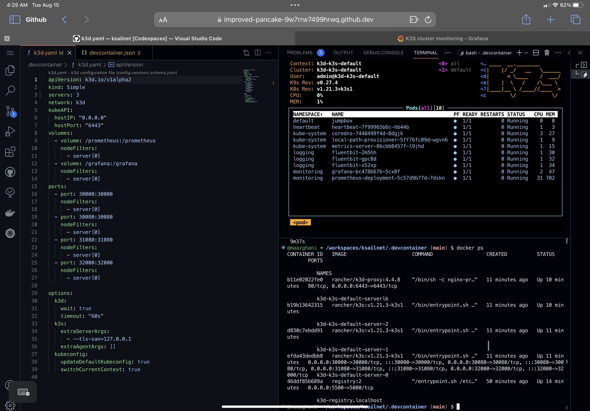
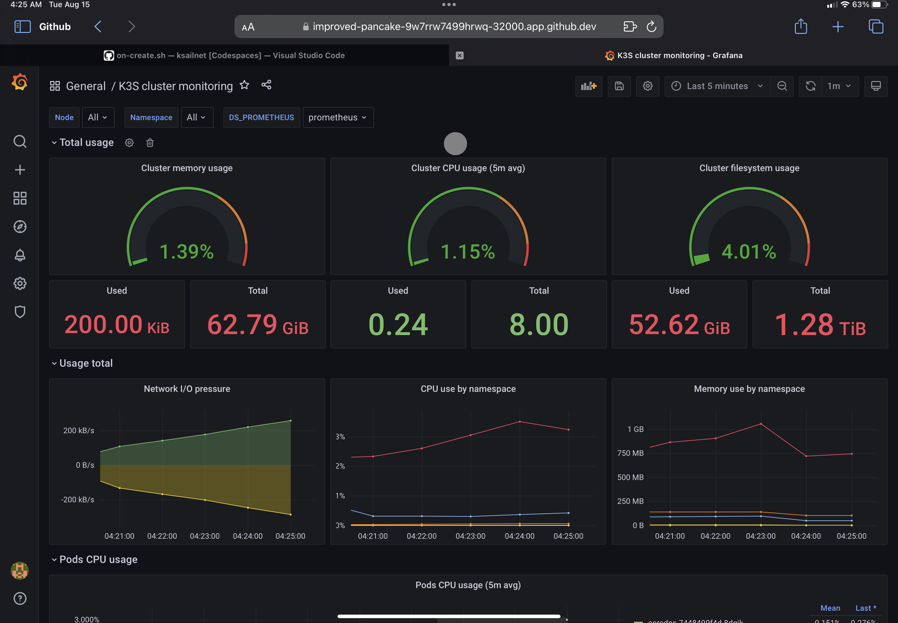

> _Generated by DALL-E: "a digital cartoon blue gopher at the helm of a simple sailboat"_


# ksailnet
# k3s running in vscode with monitoring (grafana/prom) 

_Yes I also had ChatGPT write my readme for me, deal with it_

[](https://codespaces.new/maazghani/ksailnet)

[](vscode://vscode.git/clone?url=https://github.com/maazghani/ksailnet)

<html>

</html>

## Inner Loop Development (where real development happen)


ksailnet is engineered to optimize Inner Loop Developßßßment in a cloud-native ecosystem. It addresses several key aspects to enhance developer productivity:

- **Pre-configured Environment**: The `.devcontainer` setup automates the provisioning of a development environment, eliminating the need for manual configuration.

- **Automated Deployments**: The `kic` CLI tool automates the deployment process, including building Docker images and applying Kubernetes manifests, allowing developers to focus solely on code changes.

- **Rapid Feedback Loop**: The project is designed to minimize the time between code changes and seeing those changes reflected in the running application, thus speeding up the development cycle.

- **Reduced Complexity**: By automating containerization and Kubernetes orchestration, ksailnet reduces the "developer tax" associated with these additional steps in cloud-native development.

- **Monitoring and Logging**: With out-of-the-box Prometheus and Grafana setups, developers can easily monitor the performance of their applications right from the development stage.

This streamlined approach ensures that developers can focus more on coding and less on the operational complexities, thereby accelerating the Inner Loop Development process.

## Usage

### Sample Developer Workflow for Microservice 'Disco'

1. **Clone the Repository**: Clone the ksailnet repository and navigate to the `deploy` directory.

    ```bash
    git clone https://github.com/maazghani/ksailnet.git
    cd ksailnet/deploy
    ```

2. **Add Your Service**: Clone your 'Disco' microservice into a new directory under `deploy`. Ensure it contains a Dockerfile.

    ```bash
    git clone [your-disco-repo-url] disco
    ```

3. **Build the Docker Image**: Use the `kic` CLI tool to build the Docker image for 'Disco' and push it to the local k3s registry.

    ```bash
    kic build disco
    ```

4. **Kubernetes Manifests**: Ensure that you have Kubernetes manifest files for the 'Disco' microservice in the `deploy/disco` directory.

5. **Deploy to Cluster**: Use the `kic` CLI tool to deploy all services and configurations in the `deploy` directory to your local Kubernetes cluster.

    ```bash
    kic cluster deploy
    ```

## Accessing Grafana Dashboard

You can access the Grafana dashboard by clicking on the forwarded Grafana port in your development environment. Once the Grafana login page appears, use the default credentials `admin:admin` to log in. The default dashboard can be filtered to focus on a specific namespace or your particular deployment.
<html>

</html>


# How It Works

## Core Components

### DevContainer

The `.devcontainer` directory sets up a development environment tailored for Kubernetes.

#### Key Features:
- Docker-in-Docker support
- Port forwarding for Prometheus, Heartbeat, and Grafana
- Pre-installed VS Code extensions for Kubernetes and Docker

### Deployment Configurations

Located in the `deploy` directory, these Kubernetes YAML files facilitate the deployment of Fluentbit, Prometheus, and Grafana.

#### Key Features:
- Fluentbit with a dedicated service account and permissions
- Custom dashboards for Prometheus and Grafana
- Heartbeat service for health checks

### CLI Tool (`kic`)

The `kic` CLI tool, found in the `cli` directory, offers various functionalities, including deploying an IMDb reference app to a local Kubernetes cluster.

#### Key Features:
- Validates directories before deployment
- Deletes existing deployments for fresh redeployments
- Checks for pod readiness


# Appendix
<details>
  <summary>Expand (for SREs only)</summary>
  
### A: Alternate Use Cases

The ksailnet project is not limited to simplifying Inner Loop Development; it also offers capabilities for more advanced Kubernetes configurations. One such use case is the development of `PodTopologyConstraints` and `PodDisruptionBudgets` for complex infrastructure like Kafka.

- **Creating k3d Nodes with Agents**: Using the `kic` CLI tool, you can easily create k3d nodes with agents that have specific topology labels. This enables you to simulate different zones or regions in a local development environment.

- **Developing PodTopologyConstraints**: With these labeled nodes, you can develop and test `PodTopologyConstraints` to ensure that your Kafka brokers are distributed across different zones for high availability.

- **Implementing PodDisruptionBudgets**: This setup also allows you to implement and test `PodDisruptionBudgets`, ensuring that a minimum number of Kafka brokers are available during voluntary disruptions like maintenance.

- **Benefit**: The ability to develop and test these advanced configurations locally speeds up the development cycle and ensures a more robust production deployment.

### B: Jupyter Notebooks

Jupyter Notebooks are interactive web documents that contain both code cells and Markdown text. They are widely used for data analysis, machine learning, and tutorials.

- **Interactive Demonstrations**: You can create Jupyter Notebooks with code cells that execute bash commands. This enables you to create interactive tutorials or demonstrations.

- **Creating k3d and Kafka Clusters**: For instance, a notebook could contain code cells that use `kic` to create a k3d cluster and then deploy a Kafka cluster on it.

- **Kafka Operations**: Subsequent code cells could run Kafka scripts to create topics, produce messages, and consume from topics.

- **Testing Resiliency**: Finally, you could demonstrate the resiliency of your Kafka cluster by using `PodTopologyConstraints`. Code cells could simulate zone failures by draining or deleting nodes, allowing you to observe how well your Kafka cluster handles these disruptions.

This approach offers a hands-on way to understand and demonstrate complex Kubernetes configurations and their behavior under different conditions.

</detail>

##
## k9s + zsh + vscode

